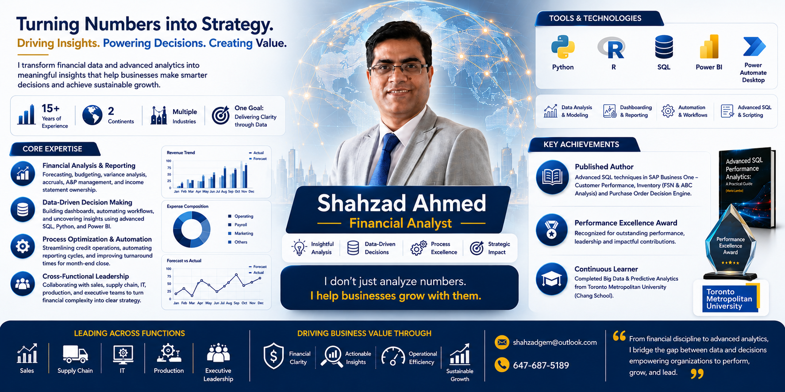

<!--
GitHub Profile README
Profile: github.com/shahgem
Image folder: /assets

Required image:
assets/shahzad-banner.png
-->

  

<!-- ════════════════════════════════════════════
     ANIMATED ROLE TYPING
════════════════════════════════════════════ -->

  

<h2 align="center" style="color:#002855;">Finance | Analytics | Business Intelligence | Automation</h2>

  I build finance-focused analytics, forecasting, reporting, and decision-support solutions that help businesses act with clarity.

  
  
  

  

---

## 🧭 About Me

<table>
<tr>
<td width="55%" valign="top">

### Turning financial data into business direction

I am a finance and analytics professional focused on transforming financial, operational, sales, purchase, and inventory data into meaningful business insight.

My work combines **financial analysis, SQL reporting, Power BI dashboards, Python-based analytics, forecasting, automation, and decision intelligence**.

I enjoy building practical tools that help leadership teams understand performance, identify risk, improve planning, and make faster decisions.

</td>
<td width="45%" valign="top">

### Current Focus

  
  
  
  
  
  
  
  

### Professional Edge

- Finance-first analytical thinking
- Business storytelling through dashboards
- Practical automation for reporting workflows
- Decision-focused analytics, not just charts

</td>
</tr>
</table>

---

## Executive Snapshot

  

<table>
<tr>
<td align="center" width="25%" bgcolor="#F8FBFF">
  <h2>15+</h2>
  
    
  Years of finance, accounting, analytics, reporting, and business support experience
</td>
<td align="center" width="25%" bgcolor="#EAF4FF">
  <h2>Finance + Data</h2>
  
    
  Combining financial discipline with data analytics and business intelligence
</td>
<td align="center" width="25%" bgcolor="#F8FBFF">
  <h2>SQL | Python | BI</h2>
  
    
  Building reporting, forecasting, automation, and dashboarding solutions
</td>
<td align="center" width="25%" bgcolor="#EAF4FF">
  <h2>Decision Systems</h2>
  
    
  Turning raw data into practical tools for leadership and operational decisions
</td>
</tr>
</table>

---

## 🛠️ Core Expertise

<table>
<tr>
<td width="50%" valign="top" bgcolor="#F8FBFF">

### 💰 Finance Performance Control

- Forecasting, budgeting, and variance analysis
- Income statement and profitability analysis
- Management reporting and KPI dashboards
- Business performance monitoring

</td>
<td width="50%" valign="top" bgcolor="#EAF4FF">

### 📊 Analytics for Better Decisions

- SQL reporting and data extraction
- Python analytics and forecasting
- Power BI dashboards
- Automated business reporting workflows

</td>
</tr>

<tr>
<td width="50%" valign="top" bgcolor="#EAF4FF">

### ⚙️ Workflow Improvement

- Reporting automation
- Operational workflow improvement
- Month-end close support
- Exception reporting and control checks

</td>
<td width="50%" valign="top" bgcolor="#F8FBFF">

### 🤝 Business Partnership

- Collaboration with sales, supply chain, IT, production, and leadership teams
- Translating complex financial data into clear business actions
- Supporting strategic and operational decisions

</td>
</tr>
</table>

---

## Tools & Technologies

  
  
  
  
  
  

  
  
  
  
  
  
  

---

## Featured Repositories

<table>
  <tr>
    <td width="50%" valign="top">
      <b>🛍️ PURCHASE INTELLIGENCE</b> 
      
      <b>Value:</b> Vendor review, inventory control, and executive-ready purchase intelligence.
    </td>
    <td width="50%" valign="top">
      <b>📉 MARKET FORECASTING</b> 
      
      <b>Value:</b> Time-series machine learning (ARIMA, Prophet, LSTM) for financial modeling.
    </td>
  </tr>
  <tr>
    <td width="50%" valign="top">
      <b>👥 PREDICTIVE ANALYTICS</b> 
      
      <b>Value:</b> Customer behavior analysis, risk identification, and retention strategy.
    </td>
    <td width="50%" valign="top">
      <b>📚 RESEARCH & PUBLICATIONS</b> 
      
      <b>Value:</b> Documentation of SQL performance, reporting, and analytics workflows.
    </td>
  </tr>
</table>

---

## 🚀 Project Highlights

<table>
<tr>
<td width="50%" valign="top" bgcolor="#F8FBFF">

### 🛒 PO Decision Engine

A purchase intelligence and decision-support application designed for smarter inventory, vendor, cash-flow, and procurement decisions.

**Business value:**

- Purchase planning
- Vendor review
- Inventory control
- Finance-aware decision support
- Executive-ready purchase intelligence

</td>
<td width="50%" valign="top" bgcolor="#EAF4FF">

### 📈 Cryptocurrency Price Forecasting

A time-series forecasting project focused on predicting cryptocurrency prices using machine learning and statistical forecasting models.

**Techniques include:**

- ARIMA
- SARIMA
- Exponential Smoothing
- Prophet
- LSTM

</td>
</tr>

<tr>
<td width="50%" valign="top" bgcolor="#EAF4FF">

### 👥 Customer Churn Prediction

A predictive analytics project focused on identifying customer churn patterns and supporting customer retention strategy.

**Business value:**

- Customer behavior analysis
- Churn risk identification
- Retention planning support
- Classification modeling

</td>
<td width="50%" valign="top" bgcolor="#F8FBFF">

### 📚 Blogs & Articles

A collection of articles, notes, and learning material focused on analytics, SQL, reporting, business intelligence, and practical data projects.

**Topics include:**

- SQL performance
- Analytics workflows
- Business reporting
- Finance-focused data analysis

</td>
</tr>
</table>

## 🔄 The Data-to-Decision Pipeline

   ➔
   ➔
   ➔
   ➔
   ➔
   ➔
  

<table>
  <tr>
    <td width="33%" align="center">
      <b>Data Engineering</b> 
      Extraction, validation, and reconciliation of finance and operations data.
    </td>
    <td width="33%" align="center">
      <b>Business Intelligence</b> 
      Finding drivers and risks; creating executive KPI dashboards.
    </td>
    <td width="33%" align="center">
      <b>Strategic Execution</b> 
      Converting complex analytics into tangible growth and efficiency.
    </td>
  </tr>
</table>

---

## Business Areas I Support

  
  
  
  
  

---

## GitHub Analytics

  
  
  

  

---

## Professional Statement

> From financial discipline to advanced analytics, I bridge the gap between data and decisions, helping organizations perform, grow, and lead.

---

## Connect With Me

  
  
  

<!-- 
Optional email button.
Only uncomment this section if you want your email public on GitHub.

  

-->

---

  <strong>I do not just analyze numbers. I help businesses grow with them.</strong>

  

