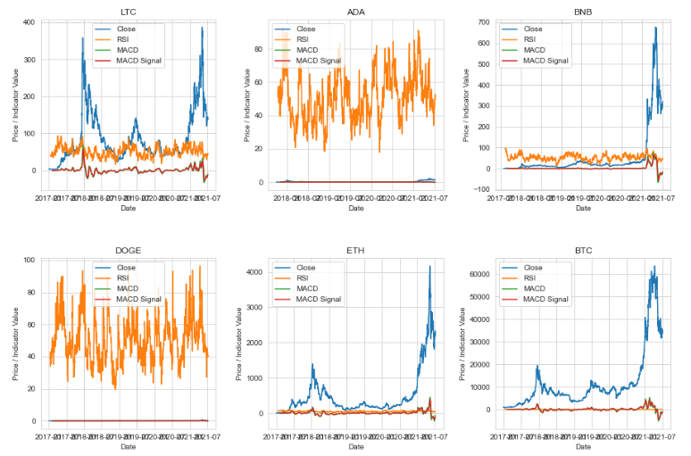
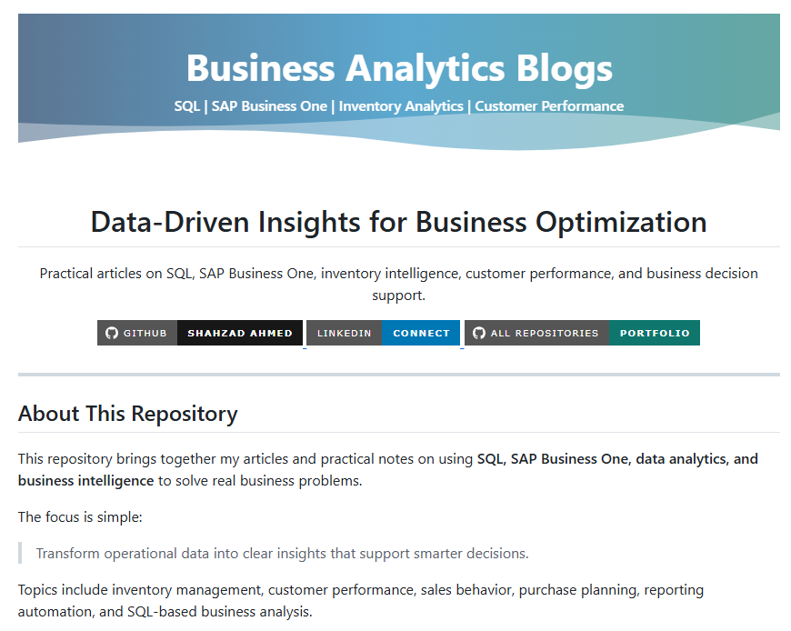

<!-- Banner -->

  

<!-- Animated Name & Professional Title -->

  

  

<!-- Key Professional Statement (moved up) -->

  From financial discipline to advanced analytics, I bridge the gap between data and decisions, helping organizations perform, grow, and lead.

<!-- Animated Role Typing -->

  

<h2 align="center" style="color:#002855;">Finance | Business Analytics | Business Intelligence | Automation</h2>

<!-- Links -->

  
  
  

  

---

## 🧭 Executive Value Proposition

<table>
  <tr>
    <td width="33%" valign="top">
      <b>Who I Am</b>
        
      Finance and business analytics professional with 15+ years of experience across reporting, forecasting, performance control, and leadership decision support.
    </td>
    <td width="33%" valign="top">
      <b>What I Build</b>
        
      Executive dashboards, purchasing intelligence tools, forecasting models, reporting automation, and finance-aware decision systems.
    </td>
    <td width="33%" valign="top">
      <b>Why It Matters</b>
        
      Leaders need clarity before action. I design systems that expose risk, explain performance, and turn analysis into confident decisions.
    </td>
  </tr>
</table>

 

---

## Key Highlights

  

<table>
  <tr>
    <td align="center" width="25%">
      
      <h2>15+</h2>
      <b>Years of Experience</b>
       
      Finance, accounting, reporting, and business support
    </td>
    <td align="center" width="25%">
      
      <h2>Finance + Data</h2>
      <b>Analytics-Driven Insight</b>
       
      Financial discipline combined with business intelligence
    </td>
    <td align="center" width="25%">
      
      
      
      <h2>SQL | Python | BI</h2>
      <b>Reporting, Modeling & Automation</b>
       
      Building dashboards, forecasts, and decision tools
    </td>
    <td align="center" width="25%">
      
      <h2>Decision Systems</h2>
      <b>Business Impact</b>
       
      Turning raw data into practical executive actions
    </td>
  </tr>
</table>

  
  
  
  
  

---

## 🛠️ Core Expertise

<table>
<tr>
<td width="50%" valign="top" bgcolor="#F8FBFF">

### 💰 Finance Performance Control

- Forecasting, budgeting, and variance analysis
- Income statement and profitability analysis
- Management reporting and KPI dashboards
- Business performance monitoring

</td>
<td width="50%" valign="top" bgcolor="#EAF4FF">

### 📊 Analytics for Better Decisions

- SQL reporting and data extraction
- Python analytics and forecasting
- Power BI dashboards
- Automated business reporting workflows

</td>
</tr>

<tr>
<td width="50%" valign="top" bgcolor="#EAF4FF">

### ⚙️ Workflow Improvement

- Reporting automation
- Operational workflow improvement
- Month-end close support
- Exception reporting and control checks

</td>
<td width="50%" valign="top" bgcolor="#F8FBFF">

### 🤝 Business Partnership

- Collaboration with sales, supply chain, IT, production, and leadership teams
- Translating complex financial data into clear business actions
- Supporting strategic and operational decisions

</td>
</tr>
</table>

---

## 💼 Business Impact

<table>
  <tr>
    <td width="25%" valign="top"><b>Executive Dashboards</b> Leadership views that connect performance, risk, and action in one place.</td>
    <td width="25%" valign="top"><b>Cash Flow Intelligence</b> Visibility into liquidity pressure, payment timing, and working capital decisions.</td>
    <td width="25%" valign="top"><b>Inventory Optimization</b> Signals for stock risk, purchase timing, vendor exposure, and capital discipline.</td>
    <td width="25%" valign="top"><b>Forecasting</b> Forward-looking models for planning, volatility, and executive scenario review.</td>
  </tr>
  <tr>
    <td width="25%" valign="top"><b>Decision Automation</b> Repeatable workflows that reduce manual review and improve control.</td>
    <td width="25%" valign="top"><b>Purchasing Intelligence</b> Recommendation logic for what to buy, when to buy, and why.</td>
    <td width="25%" valign="top"><b>Sales Intelligence</b> Revenue, customer, margin, and trend analysis for commercial decisions.</td>
    <td width="25%" valign="top"><b>Margin Analysis</b> Profitability views that connect pricing, cost, volume, and operational drivers.</td>
  </tr>
  <tr>
    <td width="25%" valign="top"><b>Financial Reporting</b> Structured reporting for performance, variance, profitability, and control.</td>
    <td width="25%" valign="top"><b>Executive Reporting</b> Boardroom-ready summaries focused on decisions, not data noise.</td>
    <td width="25%" valign="top"><b>Business Intelligence</b> Unified reporting layers for finance, operations, sales, and supply chain.</td>
    <td width="25%" valign="top"><b>Automation</b> Automated reporting flows that improve speed, consistency, and reliability.</td>
  </tr>
</table>

 

---

## 🛠️ Tools & Technologies

<table>
  <tr>
    <td width="25%" valign="top">
      <b>Data</b>
        
      
      
      
      
      
    </td>
    <td width="25%" valign="top">
      <b>Visualization</b>
        
      
      
      
      
    </td>
    <td width="25%" valign="top">
      <b>Automation</b>
        
      
      
      
      
    </td>
    <td width="25%" valign="top">
      <b>Finance Intelligence</b>
        
      
      
      
      
      
    </td>
  </tr>
</table>

 

---

## 🚀 Featured Projects

<table>
<tr>
<td width="50%" valign="top">

### 🛒 PO Decision Engine

- Purchase intelligence and decision-support
- Vendor review and inventory control
- Finance-aware decision support
- Executive-ready purchase intelligence

  
  
  

</td>
<td width="50%" valign="top">

### 📈 Cryptocurrency Price Forecasting

- Time-series forecasting with ARIMA, Prophet, LSTM
- Financial modeling and risk assessment
- Predictive analytics for market trends

  
  
  

</td>
</tr>

<tr>
<td width="50%" valign="top">

### 👥 Customer Churn Prediction

- Customer behavior analysis
- Churn risk identification
- Retention planning support
- Classification modeling

  
  
  

</td>
<td width="50%" valign="top">

### 📚 Blogs & Articles

- SQL performance and optimization
- Analytics workflows and best practices
- Business reporting and finance-focused analysis
- Documentation of real-world projects

  
  
  

</td>
</tr>
</table>

---
## 🔄 Business & Data Analytics Pipeline

   ➔
   ➔
   ➔
   ➔
   ➔
  

<table>
  <tr>
    <td width="33%" align="center">
      <b>Business Discovery</b> 
      Understanding stakeholder needs, business processes, and success metrics.
    </td>
    <td width="33%" align="center">
      <b>Data & Analytics</b> 
      Collecting, preparing, and modeling data to uncover insights.
    </td>
    <td width="33%" align="center">
      <b>Impact & Execution</b> 
      Translating insights into actionable recommendations and measurable outcomes.
    </td>
  </tr>
</table>

---

## 🏗️ Business Domains I Drive

<table>
  <tr>
    <td align="center" width="20%"><b>Finance</b> Margins, variance, cash flow, control.</td>
    <td align="center" width="20%"><b>Sales</b> Revenue, customers, trends, performance.</td>
    <td align="center" width="20%"><b>Supply Chain</b> Purchasing, vendors, inventory, flow.</td>
    <td align="center" width="20%"><b>Operations</b> Efficiency, exceptions, process control.</td>
    <td align="center" width="20%"><b>Leadership</b> Executive reporting and decision support.</td>
  </tr>
  <tr>
    <td align="center" width="20%"><b>Purchasing</b> Buy signals, vendor review, PO logic.</td>
    <td align="center" width="20%"><b>Inventory</b> Stock risk and working capital impact.</td>
    <td align="center" width="20%"><b>Forecasting</b> Scenario visibility and planning discipline.</td>
    <td align="center" width="20%"><b>Business Intelligence</b> Clean reporting layers for decision makers.</td>
    <td align="center" width="20%"><b>Automation</b> Repeatable systems for speed and control.</td>
  </tr>
</table>

 

---

## 📈 GitHub Activity

  

  
  
  

  

---

## 🤝 Let's Connect

  
  
  

  <strong>I do not just analyze numbers. I help businesses grow with them.</strong>

  

